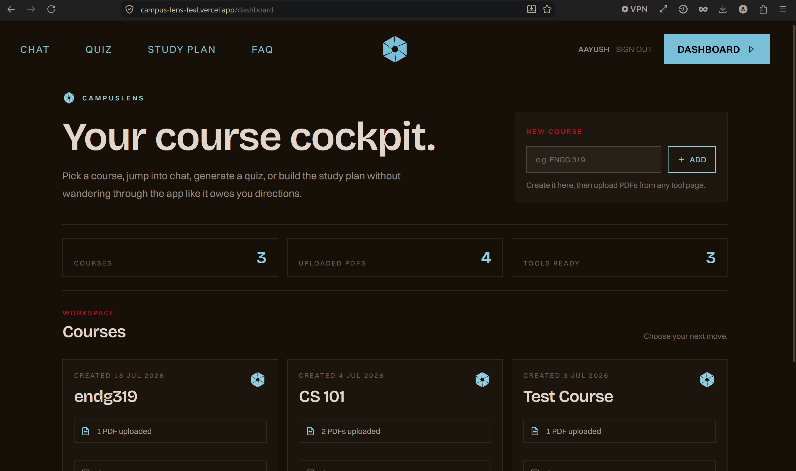
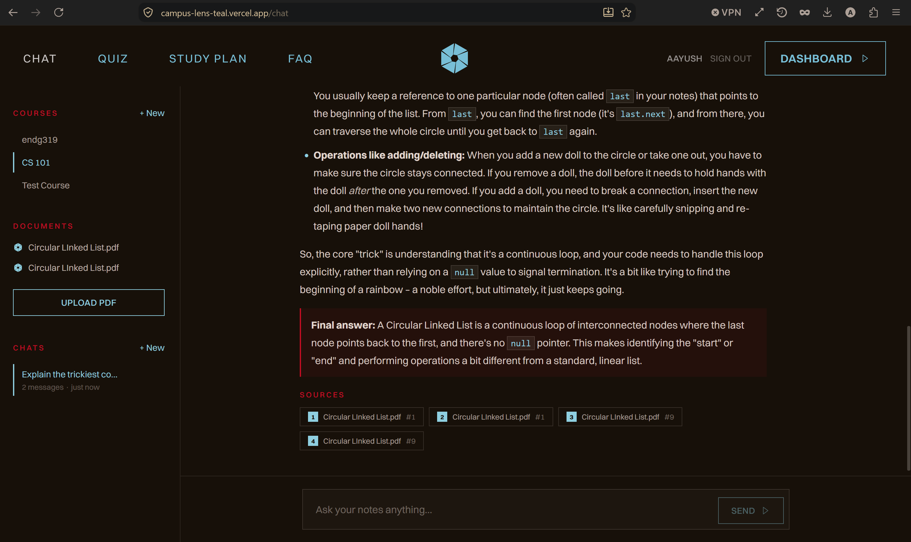
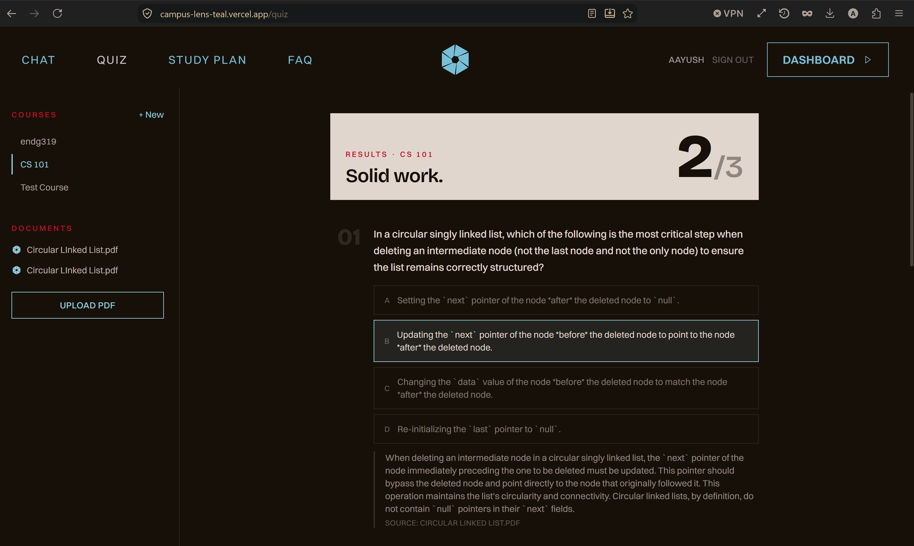
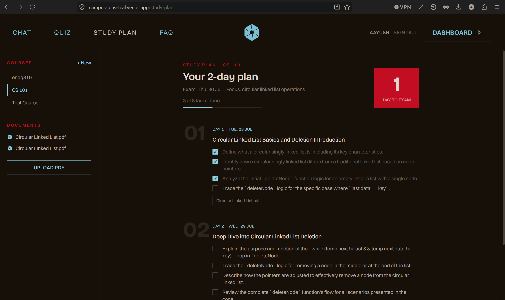

# CampusLens

**Ask your course notes anything—and get answers grounded in your own PDFs, with citations.**

### [→ Try CampusLens live](https://campus-lens-teal.vercel.app)

**Demo login:** `demo@campuslens.app` / `campuslens-demo-2026`

The demo account comes preloaded with a course, an uploaded PDF, a chat with cited answers, and a generated study plan, so you can explore every feature without uploading anything. You can also create your own account—your courses and content remain private to you.

> **Note:** The first request can take up to a minute because the free-tier backend spins down when idle and needs a moment to wake up.

CampusLens is a full-stack RAG (retrieval-augmented generation) study assistant. Students upload lecture slides or notes, and CampusLens turns them into a grounded learning workspace with source-cited chat, automatically generated practice quizzes, and day-by-day study plans based on the uploaded material—not generic templates.

## Demo

[](https://youtu.be/Hph0J1Hb7Mc)

The demo moves from the course dashboard into grounded chat, source citations, a generated quiz, and a day-by-day study plan.

## Screenshots









## Features

* **Grounded chat** — ask questions and receive answers drawn only from your uploaded PDFs. Responses stream token by token and include the source passages used to generate them.
* **Broad-question mode** — questions such as “Summarize the big ideas” or “What is most likely to appear on the exam?” retrieve context from across the course instead of relying on a narrow keyword match.
* **Practice quizzes** — generate multiple-choice questions from your course material, complete with explanations and a graded results view.
* **Study plans** — provide an exam date and receive a day-by-day plan mapped to your notes, with checkable tasks and a countdown.
* **Course workspace** — organize PDFs by course and track uploaded material from a centralized dashboard.
* **Private accounts** — email and password authentication with hashed passwords and HttpOnly session cookies. Courses, uploads, chats, and generated content are scoped to their owner.

## How it works

CampusLens uses a RAG pipeline with a grounding safeguard that prevents the model from answering beyond the retrieved course material.

```text
Upload PDF
  → extract and clean the text
  → split it using sentence-aware chunking
  → generate an embedding for each chunk with Gemini
  → store the vectors in Pinecone
  → tag each vector by course and document

Ask a question
  → generate an embedding for the question
  → search Pinecone for similar course-specific chunks
  → reject the request if the retrieved context is too weak
  → construct a grounded prompt from the strongest chunks
  → generate and stream the answer with source citations
```

For broad questions, CampusLens uses a broad retrieval seed to collect context from across the course. The same retrieval layer also powers quizzes and study plans, allowing them to use material from multiple documents instead of answering from a single passage.

## Tech stack

* **Client** — React 19, Vite, Tailwind CSS v4, React Router 7
* **Server** — Node.js, Express 5
* **Database** — MongoDB with Mongoose
* **AI and embeddings** — Google Gemini
* **Vector database** — Pinecone
* **Response streaming** — Server-Sent Events
* **Deployment** — Vercel and Render

Answers are streamed to the browser using Server-Sent Events, allowing text to appear as the model generates it.

## Local setup

### Prerequisites

* Node.js 20.19+
* A MongoDB database, such as a free MongoDB Atlas cluster
* A Pinecone index
* A Google Gemini API key

### Clone the repository

```bash
git clone https://github.com/Aayush-Karthikeyan/CampusLens.git
cd CampusLens
```

### Start the backend

From the repository root, run:

```bash
cd server
npm ci
cp .env.example .env
```

Fill in the required values inside `server/.env`, then start the server:

```bash
npm run dev
```

The backend runs at `http://localhost:3000`.

### Start the frontend

Open a second terminal from the repository root and run:

```bash
cd client
npm ci
npm run dev
```

The frontend runs at `http://localhost:5173`.

During local development, the frontend proxies API calls to the backend, so no additional API configuration is required. See `server/.env.example` and `client/.env.example` for the available environment variables.

## Deployment

The client and server are deployed independently:

* **Client → Vercel** — set `VITE_API_URL` to the deployed backend origin.
* **Server → Render** — set `CORS_ORIGIN` to the deployed frontend origin and configure the MongoDB, Pinecone, and Gemini environment variables.

## Project structure

```text
CampusLens/
├── client/       React and Vite single-page application
│                 Dashboard, chat, quizzes, and study plans
├── server/       Express API, authentication, and Mongoose models
│   └── rag/      Document processing, retrieval, and grounding pipeline
└── screenshots/  Product screenshots used in this README
```
